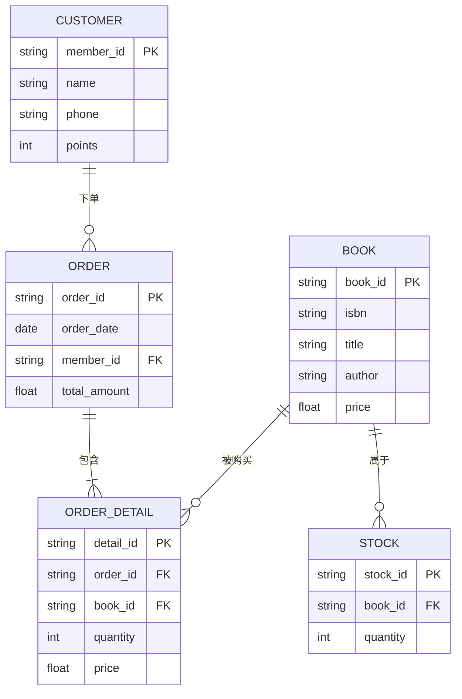

```mermaid
erDiagram
    CUSTOMER ||--o{ ORDER : "下单"
    ORDER ||--|{ ORDER_DETAIL : "包含"
    BOOK ||--o{ ORDER_DETAIL : "被购买"
    BOOK ||--o{ STOCK : "属于"
    CUSTOMER {
        string member_id PK
        string name
        string phone
        int points
    }
    ORDER {
        string order_id PK
        date order_date
        string member_id FK
        float total_amount
    }
    ORDER_DETAIL {
        string detail_id PK
        string order_id FK
        string book_id FK
        int quantity
        float price
    }
    BOOK {
        string book_id PK
        string isbn
        string title
        string author
        float price
    }
    STOCK {
        string stock_id PK
        string book_id FK
        int quantity
    }
  
```