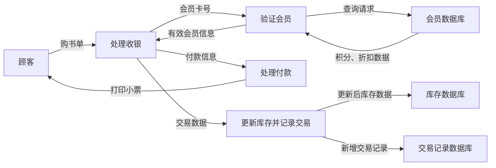

```mermaid
flowchart LR
    Customer[顾客] --> |购书单| P1[处理收银]

    P1 --> |会员卡号| P2[验证会员]
    P2 --> |查询请求| D2[会员数据库]
    D2 --> |积分、折扣数据| P2
    P2 --> |有效会员信息| P1

    P1 --> |付款信息| P3[处理付款]
    P1 --> |交易数据| P4[更新库存并记录交易]
    
    P3 --> |打印小票| Customer
    P4 --> |更新后库存数据| D3[库存数据库]
    P4 --> |新增交易记录| D4[交易记录数据库]
  
```