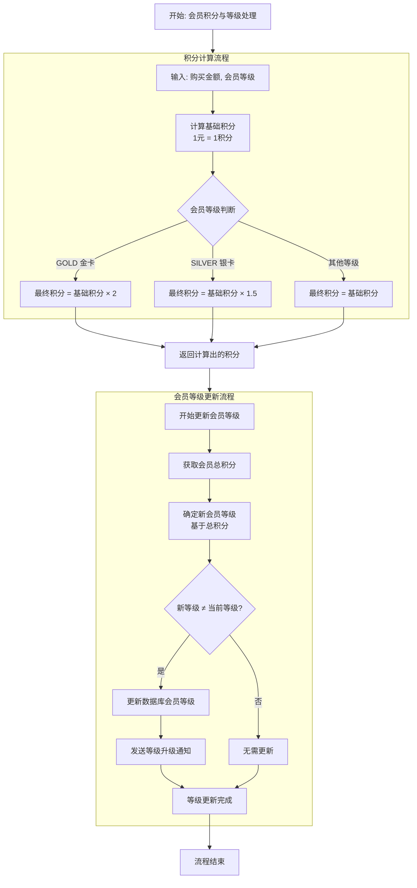

```mermaid
flowchart TD
    A[开始: 会员积分与等级处理] --> B
    
    subgraph B [积分计算流程]
        B1[输入: 购买金额, 会员等级] --> B2[计算基础积分<br>1元 = 1积分]
        B2 --> B3{会员等级判断}
        
        B3 -->|GOLD 金卡| B4[最终积分 = 基础积分 × 2]
        B3 -->|SILVER 银卡| B5[最终积分 = 基础积分 × 1.5]
        B3 -->|其他等级| B6[最终积分 = 基础积分]
    end
    
    B4 --> C
    B5 --> C
    B6 --> C
    
    C[返回计算出的积分] --> D
    direction LR
    subgraph D [会员等级更新流程]
        direction LR
        D1[开始更新会员等级] --> D2[获取会员总积分]
        D2 --> D3[确定新会员等级<br>基于总积分]
        D3 --> D4{新等级 ≠ 当前等级?}
        
        D4 -->|是| D5[更新数据库会员等级]
        D5 --> D6[发送等级升级通知]
        D6 --> D7[等级更新完成]
        
        D4 -->|否| D8[无需更新]
        D8 --> D7
    end
    
    D7 --> E[流程结束]
```