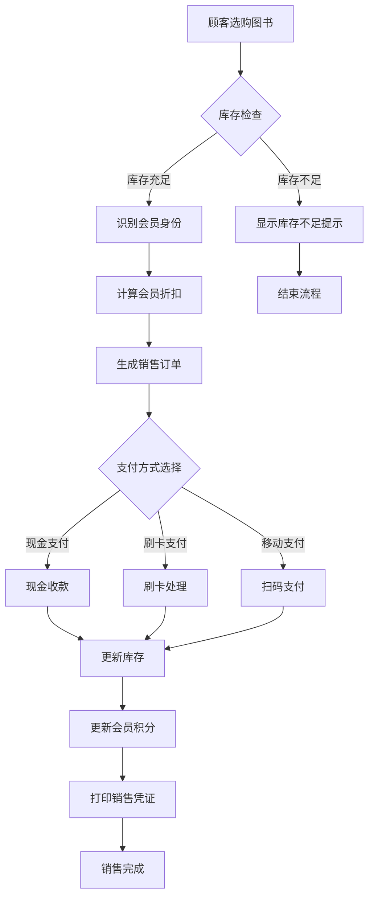

```mermaid
flowchart TD
    A[顾客选购图书] --> B{库存检查}
    B -->|库存充足| C[识别会员身份]
    B -->|库存不足| D[显示库存不足提示]
    C --> E[计算会员折扣]
    E --> F[生成销售订单]
    F --> G{支付方式选择}
    G -->|现金支付| H[现金收款]
    G -->|刷卡支付| I[刷卡处理]
    G -->|移动支付| J[扫码支付]
    H --> K[更新库存]
    I --> K
    J --> K
    K --> L[更新会员积分]
    L --> M[打印销售凭证]
    M --> N[销售完成]
    D --> O[结束流程]
```