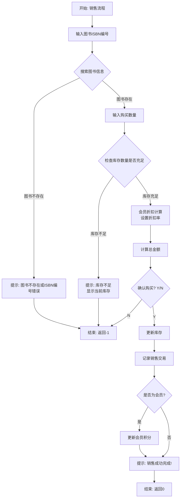

```mermaid
flowchart TD
    A[开始: 销售流程] --> B[输入图书ISBN编号]
    B --> C{搜索图书信息}
    
    C -- 图书不存在 --> D[提示: 图书不存在或ISBN编号错误]
    D --> E[结束: 返回-1]
    
    C -- 图书存在 --> F[输入购买数量]
    F --> G{检查库存数量是否充足}
    
    G -- 库存不足 --> H[提示: 库存不足<br>显示当前库存]
    H --> E
    
    G -- 库存充足 --> I[会员折扣计算<br>设置折扣率]
    I --> J[计算总金额]
    J --> K{确认购买? Y/N}
    
    K -- N --> E
    
    K -- Y --> L[更新库存]
    L --> M[记录销售交易]
    M --> N{是否为会员?}
    
    N -- 是 --> O[更新会员积分]
    O --> P[提示: 销售成功完成!]
    
    N -- 否 --> P
    
    P --> Q[结束: 返回0]
```