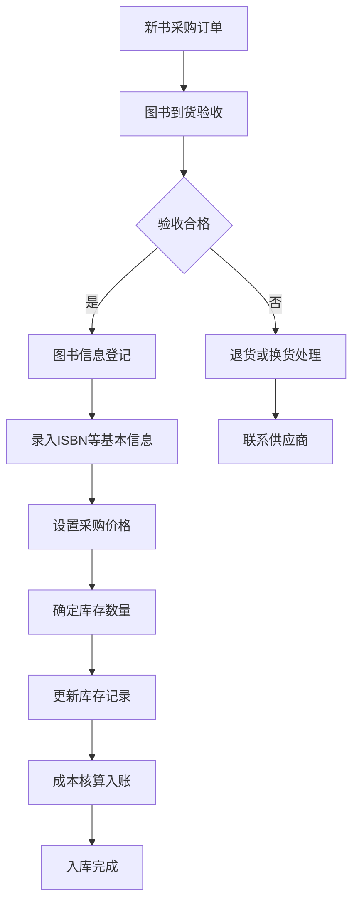

```mermaid
flowchart TD
    A[新书采购订单] --> B[图书到货验收]
    B --> C{验收合格}
    C -->|是| D[图书信息登记]
    C -->|否| E[退货或换货处理]
    D
    D --> F[录入ISBN等基本信息]
    F --> G[设置采购价格]
    G --> H[确定库存数量]
    H --> I[更新库存记录]
    I --> J[成本核算入账]
    J --> K[入库完成]
    E --> L[联系供应商]
```