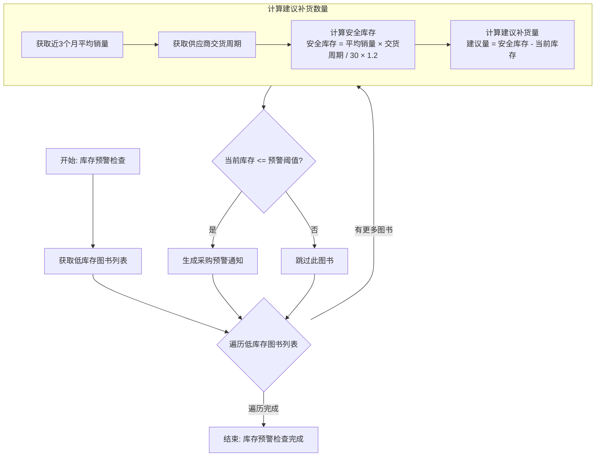

```mermaid
flowchart TD
    A[开始: 库存预警检查] --> B[获取低库存图书列表]
    B --> C{遍历低库存图书列表}
    
    C -- 有更多图书 --> D[计算建议补货数量]
    
    subgraph D [计算建议补货数量]
        D1[获取近3个月平均销量] --> D2[获取供应商交货周期]
        D2 --> D3[计算安全库存<br>安全库存 = 平均销量 × 交货周期 / 30 × 1.2]
        D3 --> D4[计算建议补货量<br>建议量 = 安全库存 - 当前库存]
    end
    
    D --> E{当前库存 <= 预警阈值?}
    
    E -- 是 --> F[生成采购预警通知]
    E -- 否 --> G[跳过此图书]
    
    F --> C
    G --> C
    
    C -- 遍历完成 --> H[结束: 库存预警检查完成]
```