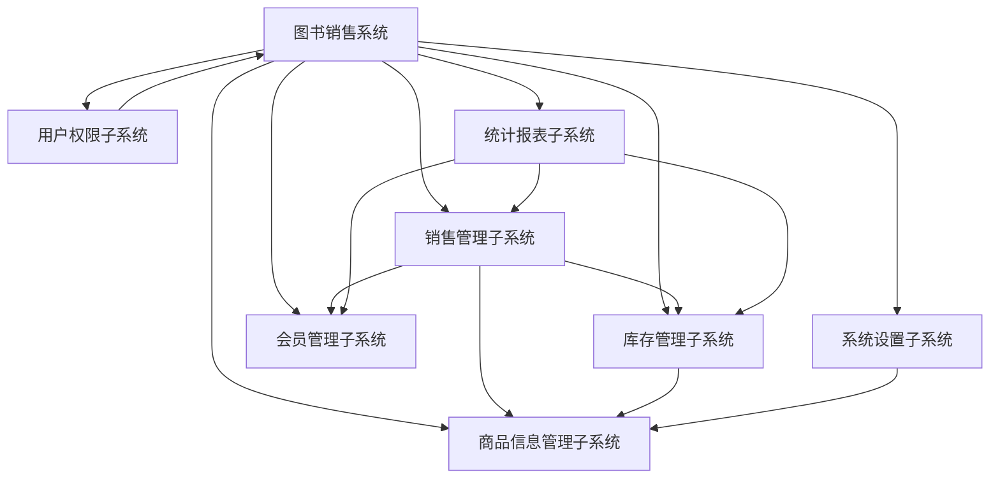

```mermaid
graph TD
    A[图书销售系统] --> B[用户权限子系统]
    A --> C[商品信息管理子系统]
    A --> D[库存管理子系统]
    A --> E[销售管理子系统]
    A --> F[会员管理子系统]
    A --> G[统计报表子系统]
    A --> H[系统设置子系统]

    E --> C
    E --> D
    E --> F
    D --> C
    G --> E
    G --> D
    G --> F
    B --> A
    H --> C
```