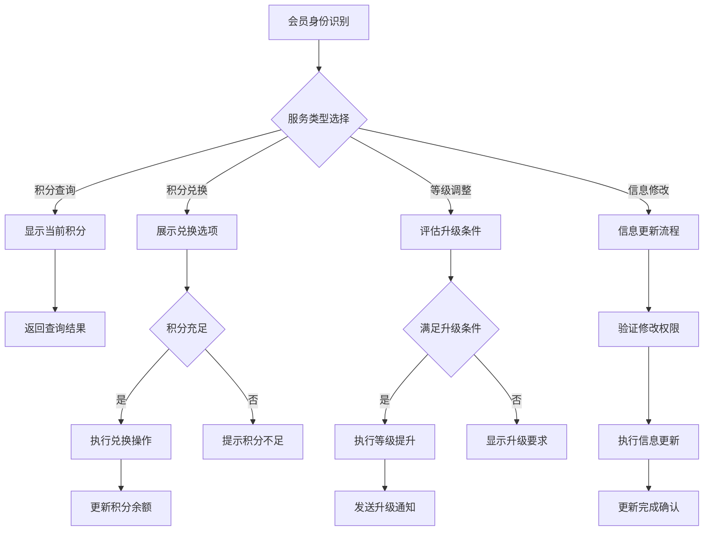

```mermaid
flowchart TD
    A[会员身份识别] --> B{服务类型选择}
    B -->|积分查询| C[显示当前积分]
    B -->|积分兑换| D[展示兑换选项]
    B -->|等级调整| E[评估升级条件]
    B -->|信息修改| F[信息更新流程]
    
    C --> G[返回查询结果]
    D --> H{积分充足}
    H -->|是| I[执行兑换操作]
    H -->|否| J[提示积分不足]
    I --> K[更新积分余额]
    
    E --> L{满足升级条件}
    L -->|是| M[执行等级提升]
    L -->|否| N[显示升级要求]
    M --> O[发送升级通知]
    
    F --> P[验证修改权限]
    P --> Q[执行信息更新]
    Q --> R[更新完成确认]
```